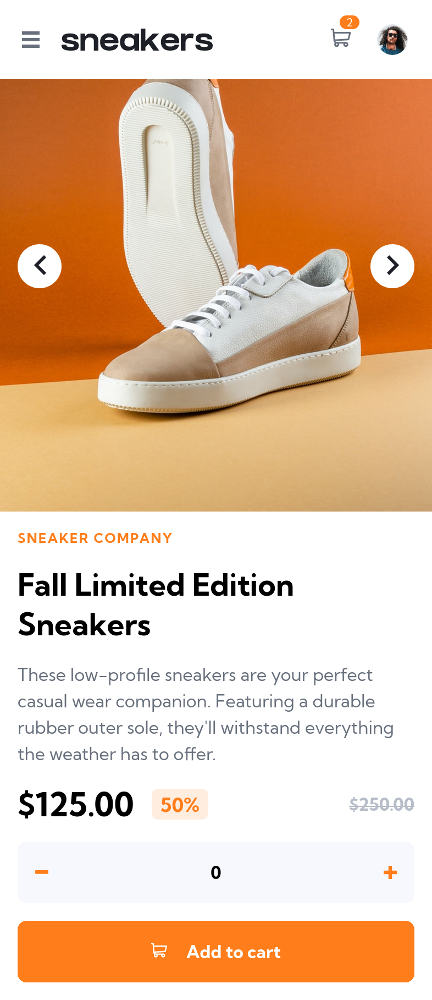
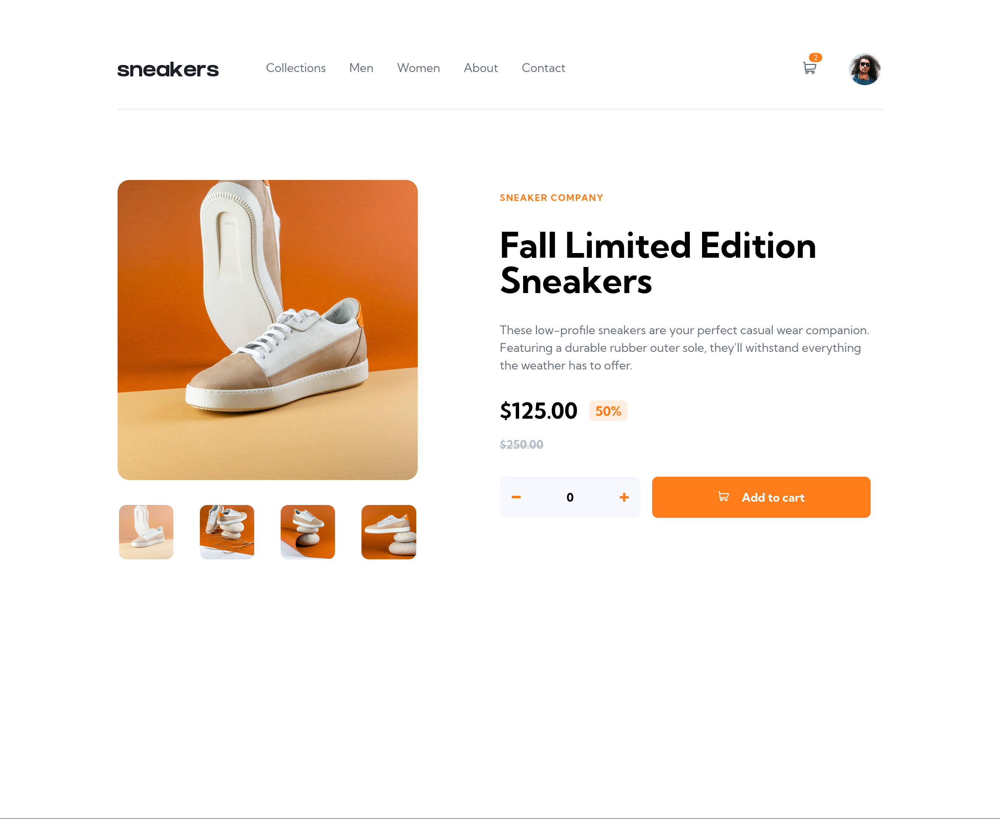

# Frontend Mentor - E-commerce product page

This is a solution to the [E-commerce product page challenge on Frontend Mentor](https://www.frontendmentor.io/challenges/ecommerce-product-page-UPsZ9MJp6). Frontend Mentor challenges help you improve your coding skills by building realistic projects.

## Overview

### Screenshot

  

### Links

- Live Site URL: [Github Pages](https://h-mihail.github.io/fe-mentor-ecommerce-product-page/)

## My process

### Built with

- Semantic HTML5 markup
- CSS custom properties
- Flexbox
- Mobile-first workflow
- [React](https://react.dev/) - JS library
- [Tailwind](https://tailwindcss.com/) - CSS framework
- [Vite](https://vitejs.dev/) - Frontend utility
